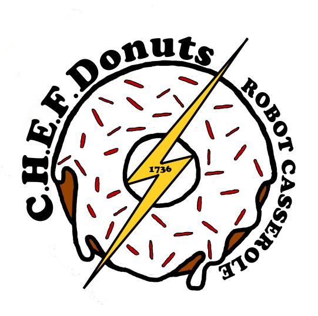
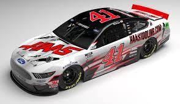

# RobotCasserole2023
Software for Robot Casserole's 2023 Charged Up 🔋⚡ Competition Season

## Contents
1. Driver View
2. Main Source Code
3. LocalHost Link
4. Necessary Fractal

## 1. Driver View Website
  The Driver View web site is used to help test and tweak our code, and used to help drive team during match. The driver view is a javascript/HTML based viewer of data logs captured from the robot during operation. These data logs are then used to tweak code before, during, and after competition. 

## 2. Main Source Code

  
  What we currently have for our 2023 Robot Code is a fully functioning swerve drive and a boom-stick claw intake.  In addition we have worked on improving the quality of life for the Robot Dashboard, as well as a fully mapped out teleoperated controller.
   [here](https://github.com/RobotCasserole1736/RobotCasserole2023/tree/main/RobotCode).
  
## 3. LocalHost website 
  Here is a link to the localhost website used for sims and robot testing.  Some minor updates have occured but otherwise it is the classic website.
  (Just a heads up you'll need running code in simulation for the link to work.)
  [I dare you to click here](http://localhost:5805/)

## 4. ATTENTION!!! THIS IS THE MANDELBROT FRACTAL:
   

